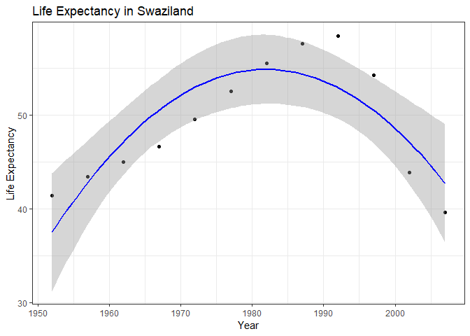

hw06 - yavyx
================
Javier Castillo-Arnemann

As usual, we'll start by loading the necessary packages

``` r
suppressPackageStartupMessages(library(tidyverse))
library(broom)
library(gapminder)
library(MASS)
```

    ## 
    ## Attaching package: 'MASS'

    ## The following object is masked from 'package:dplyr':
    ## 
    ##     select

Working with a nested data frame
--------------------------------

We will first create a nested Gapminder dataframe to be able to run more complicated analysis in each group of interest (country and continent) than would be possible with the `group_by()` function.

``` r
nested_gapminder <- gapminder %>%
  group_by(continent, country) %>%
  nest()
```

Let's take a look at this new dataframe

``` r
nested_gapminder
```

    ## # A tibble: 142 x 3
    ##    continent country     data             
    ##    <fct>     <fct>       <list>           
    ##  1 Asia      Afghanistan <tibble [12 x 4]>
    ##  2 Europe    Albania     <tibble [12 x 4]>
    ##  3 Africa    Algeria     <tibble [12 x 4]>
    ##  4 Africa    Angola      <tibble [12 x 4]>
    ##  5 Americas  Argentina   <tibble [12 x 4]>
    ##  6 Oceania   Australia   <tibble [12 x 4]>
    ##  7 Europe    Austria     <tibble [12 x 4]>
    ##  8 Asia      Bahrain     <tibble [12 x 4]>
    ##  9 Asia      Bangladesh  <tibble [12 x 4]>
    ## 10 Europe    Belgium     <tibble [12 x 4]>
    ## # ... with 132 more rows

There is a row for every country, and a tibble corresponding to each one. Let's see the information contained in each tibble.

``` r
nested_gapminder$data[1]
```

    ## [[1]]
    ## # A tibble: 12 x 4
    ##     year lifeExp      pop gdpPercap
    ##    <int>   <dbl>    <int>     <dbl>
    ##  1  1952    28.8  8425333      779.
    ##  2  1957    30.3  9240934      821.
    ##  3  1962    32.0 10267083      853.
    ##  4  1967    34.0 11537966      836.
    ##  5  1972    36.1 13079460      740.
    ##  6  1977    38.4 14880372      786.
    ##  7  1982    39.9 12881816      978.
    ##  8  1987    40.8 13867957      852.
    ##  9  1992    41.7 16317921      649.
    ## 10  1997    41.8 22227415      635.
    ## 11  2002    42.1 25268405      727.
    ## 12  2007    43.8 31889923      975.

Here we can see the information that corresponds to the first country, Afghanistan.

Next, we'll define functions to get linear least-squares and robust regressions to be able to compare how accurately they model the data. We'll model how population life expeectancy through time in each country.

``` r
linear_model <- function(data) {
  offset <- min(data$year)
  lm(lifeExp ~ I(year - offset), data)
}

robust_model <- function(data) {
  offset <- min(data$year)
  rlm(lifeExp ~ I(year - offset), data) 
}
```

The `I()` function tells R to interpret the minus sign as an arithmetic operator instead of a formula operator. The offset is to ensure that our model has the right intercept, and corresponds to the lowest year value in each dataset.

We will test our functions with the first country and to confirm it's working as it should before iterating through every country.

``` r
linear_model(nested_gapminder$data[[1]])
```

    ## 
    ## Call:
    ## lm(formula = lifeExp ~ I(year - offset), data = data)
    ## 
    ## Coefficients:
    ##      (Intercept)  I(year - offset)  
    ##          29.9073            0.2753

It weems to be working, so we will add a new column to our nested dataframe with the information from each model.

``` r
nested_gapminder <- nested_gapminder %>%
  mutate(linear_fit = map(data, linear_model),
         robust_fit = map(data, robust_model))  
```

    ## Warning in rlm.default(x, y, weights, method = method, wt.method =
    ## wt.method, : 'rlm' failed to converge in 20 steps

    ## Warning in rlm.default(x, y, weights, method = method, wt.method =
    ## wt.method, : 'rlm' failed to converge in 20 steps

    ## Warning in rlm.default(x, y, weights, method = method, wt.method =
    ## wt.method, : 'rlm' failed to converge in 20 steps

After doing this, we can use the `broom` package to see how every data point is modeled and extract the data that we want from each model. For this, we use the `augment()` function that gives us the residuals for every data point.

``` r
nested_gapminder <- nested_gapminder %>%
    mutate(linear_augment = map(linear_fit, augment),
           robust_augment = map(robust_fit, augment))

nested_gapminder$linear_augment[[1]] #checking contents of first tibble
```

    ## # A tibble: 12 x 9
    ##    lifeExp I.year...offset. .fitted .se.fit  .resid   .hat .sigma .cooksd
    ##  *   <dbl>         <I(int)>   <dbl>   <dbl>   <dbl>  <dbl>  <dbl>   <dbl>
    ##  1    28.8                0    29.9   0.664 -1.11   0.295    1.21 2.43e-1
    ##  2    30.3                5    31.3   0.580 -0.952  0.225    1.24 1.13e-1
    ##  3    32.0               10    32.7   0.503 -0.664  0.169    1.27 3.60e-2
    ##  4    34.0               15    34.0   0.436 -0.0172 0.127    1.29 1.65e-5
    ##  5    36.1               20    35.4   0.385  0.674  0.0991   1.27 1.85e-2
    ##  6    38.4               25    36.8   0.357  1.65   0.0851   1.15 9.23e-2
    ##  7    39.9               30    38.2   0.357  1.69   0.0851   1.15 9.67e-2
    ##  8    40.8               35    39.5   0.385  1.28   0.0991   1.21 6.67e-2
    ##  9    41.7               40    40.9   0.436  0.754  0.127    1.26 3.17e-2
    ## 10    41.8               45    42.3   0.503 -0.534  0.169    1.27 2.33e-2
    ## 11    42.1               50    43.7   0.580 -1.54   0.225    1.15 2.99e-1
    ## 12    43.8               55    45.1   0.664 -1.22   0.295    1.19 2.96e-1
    ## # ... with 1 more variable: .std.resid <dbl>

``` r
nested_gapminder$robust_augment[[1]] #checking contents of first tibble
```

    ## # A tibble: 12 x 7
    ##    lifeExp I.year...offset. .fitted .se.fit  .resid   .hat .sigma
    ##  *   <dbl>         <I(int)>   <dbl>   <dbl>   <dbl>  <dbl>  <dbl>
    ##  1    28.8                0    29.9   0.829 -1.11   0.295    1.21
    ##  2    30.3                5    31.3   0.724 -0.952  0.225    1.24
    ##  3    32.0               10    32.7   0.627 -0.664  0.169    1.27
    ##  4    34.0               15    34.0   0.544 -0.0172 0.127    1.29
    ##  5    36.1               20    35.4   0.480  0.674  0.0991   1.27
    ##  6    38.4               25    36.8   0.445  1.65   0.0851   1.15
    ##  7    39.9               30    38.2   0.445  1.69   0.0851   1.15
    ##  8    40.8               35    39.5   0.480  1.28   0.0991   1.21
    ##  9    41.7               40    40.9   0.544  0.754  0.127    1.26
    ## 10    41.8               45    42.3   0.627 -0.534  0.169    1.27
    ## 11    42.1               50    43.7   0.724 -1.54   0.225    1.15
    ## 12    43.8               55    45.1   0.829 -1.22   0.295    1.19

Now we can unnest the dataframe to perform some analysis on the residuals.

``` r
gapminder_residuals <- nested_gapminder %>%
  dplyr::select(continent, country, linear_augment, robust_augment) %>%
  unnest(linear_augment, robust_augment)
```

``` r
gapminder_residuals <- gapminder_residuals %>%
  mutate(residuals_diff = .resid  - .resid1) #Get the difference in residuals 

knitr::kable(gapminder_residuals %>%
  filter(residuals_diff == max(residuals_diff))) #Find the country with the highest residual difference between the two models
```

| continent | country   |  lifeExp|  I.year...offset.|   .fitted|   .se.fit|     .resid|       .hat|    .sigma|    .cooksd|  .std.resid|  lifeExp1|  I.year...offset.1|  .fitted1|  .se.fit1|    .resid1|      .hat1|   .sigma1|  residuals\_diff|
|:----------|:----------|--------:|-----------------:|---------:|---------:|----------:|----------:|---------:|----------:|-----------:|---------:|------------------:|---------:|---------:|----------:|----------:|---------:|----------------:|
| Africa    | Swaziland |   39.613|                55|  51.61697|  3.607881|  -12.00397|  0.2948718|  5.132533|  0.9679346|    -2.15157|    39.613|                 55|  56.10929|  2.370341|  -16.49629|  0.1491858|  4.595783|         4.492318|

``` r
knitr::kable(gapminder_residuals %>%
  arrange(residuals_diff) %>%
  head()) #Arrange the data in order of residual difference
```

| continent | country      |  lifeExp|  I.year...offset.|   .fitted|   .se.fit|     .resid|       .hat|    .sigma|    .cooksd|  .std.resid|  lifeExp1|  I.year...offset.1|  .fitted1|  .se.fit1|     .resid1|      .hat1|   .sigma1|  residuals\_diff|
|:----------|:-------------|--------:|-----------------:|---------:|---------:|----------:|----------:|---------:|----------:|-----------:|---------:|------------------:|---------:|---------:|-----------:|----------:|---------:|----------------:|
| Africa    | Swaziland    |   41.407|                 0|  46.38786|  3.607881|  -4.980859|  0.2948718|  6.718597|  0.1666496|  -0.8927598|    41.407|                  0|  44.55009|  2.370341|  -3.1430950|  0.3152636|  7.419998|        -1.837764|
| Africa    | South Africa |   45.009|                 0|  49.34128|  2.576285|  -4.332282|  0.2948718|  4.696000|  0.2472555|  -1.0874402|    45.009|                  0|  47.53848|  1.278755|  -2.5294754|  0.3223630|  5.572398|        -1.802807|
| Africa    | Lesotho      |   42.138|                 0|  47.37903|  3.222250|  -5.241026|  0.2948718|  5.898781|  0.2313206|  -1.0518155|    42.138|                  0|  45.73783|  2.070575|  -3.5998253|  0.3162245|  6.542944|        -1.641200|
| Africa    | Swaziland    |   43.424|                 5|  46.86323|  3.151161|  -3.439233|  0.2249417|  6.881362|  0.0501676|  -0.5879750|    43.424|                  5|  45.60093|  2.070280|  -2.1769311|  0.2345422|  7.481412|        -1.262302|
| Africa    | South Africa |   47.985|                 5|  50.18708|  2.250154|  -2.202079|  0.2249417|  4.930998|  0.0403351|  -0.5272159|    47.985|                  5|  48.94244|  1.116878|  -0.9574361|  0.2378603|  5.653944|        -1.244643|
| Africa    | Lesotho      |   45.047|                 5|  47.85685|  2.814347|  -2.809854|  0.2249417|  6.163774|  0.0419811|  -0.5378658|    45.047|                  5|  46.72121|  1.808462|  -1.6742121|  0.2348470|  6.671495|        -1.135642|

It is Swaziland, so let's plot its information to take a closer look at what's going on.

``` r
gapminder %>%
  filter(country == "Swaziland") %>%
  ggplot(aes(year, lifeExp)) +
    geom_point() +
    geom_smooth(method = "lm", color = "blue") +
    geom_smooth(method = "rlm", color = "red") +
    labs(title = "Life Expectancy in Swaziland",
         x = "Year",
         y = "Life Expectancy") +
    theme_bw()
```

    ## Warning in rlm.default(x, y, weights, method = method, wt.method =
    ## wt.method, : 'rlm' failed to converge in 20 steps


Neither model really gets close to the actual data, because it doesn't seem to behave in a linear way. Therefore, a quadratic model makes more sense in this case:

``` r
gapminder %>%
  filter(country == "Swaziland") %>%
  ggplot(aes(x = year, y = lifeExp)) +
    geom_point() +
    geom_smooth(method = "lm", formula = y ~ x + I(x^2), color = "blue") + #specify qudratic model
    labs(title = "Life Expectancy in Swaziland",
         x = "Year",
         y = "Life Expectancy") +
    theme_bw()
```



References
----------

-   [Robust Regression Using R](http://www.alastairsanderson.com/R/tutorials/robust-regression-in-R/)
-   [MASS:rlm Documentation](https://stat.ethz.ch/R-manual/R-devel/library/MASS/html/rlm.html)
