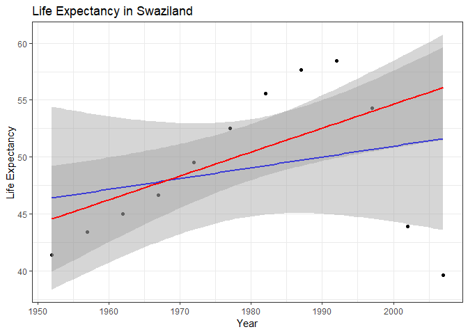

hw06 - yavyx
================
Javier Castillo-Arnemann

As usual, we'll start by loading the necessary packages

``` r
suppressPackageStartupMessages(library(tidyverse))
library(broom)
library(gapminder)
```

Working with a nested data frame
--------------------------------

We will first create a nested Gapminder dataframe to be able to run more complicated analysis in each group of interest (country and continent) than would only be possible with the `group_by()` function.

``` r
nested_gapminder <- gapminder %>%
  group_by(continent, country) %>%
  nest()
```

Let's take a look at this new dataframe

``` r
nested_gapminder
```

    ## # A tibble: 142 x 3
    ##    continent country     data             
    ##    <fct>     <fct>       <list>           
    ##  1 Asia      Afghanistan <tibble [12 × 4]>
    ##  2 Europe    Albania     <tibble [12 × 4]>
    ##  3 Africa    Algeria     <tibble [12 × 4]>
    ##  4 Africa    Angola      <tibble [12 × 4]>
    ##  5 Americas  Argentina   <tibble [12 × 4]>
    ##  6 Oceania   Australia   <tibble [12 × 4]>
    ##  7 Europe    Austria     <tibble [12 × 4]>
    ##  8 Asia      Bahrain     <tibble [12 × 4]>
    ##  9 Asia      Bangladesh  <tibble [12 × 4]>
    ## 10 Europe    Belgium     <tibble [12 × 4]>
    ## # ... with 132 more rows

There is a row for every country, and a tibble corresponding to each one. Let's see the information contained in each tibble.

``` r
nested_gapminder$data[1]
```

    ## [[1]]
    ## # A tibble: 12 x 4
    ##     year lifeExp      pop gdpPercap
    ##    <int>   <dbl>    <int>     <dbl>
    ##  1  1952    28.8  8425333      779.
    ##  2  1957    30.3  9240934      821.
    ##  3  1962    32.0 10267083      853.
    ##  4  1967    34.0 11537966      836.
    ##  5  1972    36.1 13079460      740.
    ##  6  1977    38.4 14880372      786.
    ##  7  1982    39.9 12881816      978.
    ##  8  1987    40.8 13867957      852.
    ##  9  1992    41.7 16317921      649.
    ## 10  1997    41.8 22227415      635.
    ## 11  2002    42.1 25268405      727.
    ## 12  2007    43.8 31889923      975.

Here we can see the information that corresponds to the first country, Afghanistan.

Next, we'll define functions to get linear least-squares and robust regressions to be able to compare how accurately they model the data. We'll model how population changes through time in each country.

``` r
linear_model <- function(data) {
  offset <- min(data$year)
  lm(pop ~ I(year - offset), data)
}

robust_model <- function(data) {
  offset <- min(data$year)
  MASS::rlm(pop ~ I(year - offset), data) 
}
```

The `I()` function tells R to interpret the minus sign as an arithmetic operator instead of a formula operator. The offset is to ensure that our model has the right intercept, and corresponds to the lowest year value in each dataset.

We will test our functions with the first country and to confirm it's working as it should before iterating through every country.

``` r
linear_model(nested_gapminder$data[[1]])
```

    ## 
    ## Call:
    ## lm(formula = pop ~ I(year - offset), data = data)
    ## 
    ## Coefficients:
    ##      (Intercept)  I(year - offset)  
    ##          6009355            356886

``` r
robust_model(nested_gapminder$data[[1]])
```

    ## Call:
    ## rlm(formula = pop ~ I(year - offset), data = data)
    ## Converged in 10 iterations
    ## 
    ## Coefficients:
    ##      (Intercept) I(year - offset) 
    ##        6666106.7         330909.1 
    ## 
    ## Degrees of freedom: 12 total; 10 residual
    ## Scale estimate: 1990000

It weems to be working, so we will add a new column to our nested dataframe with the information of each model.

``` r
nested_gapminder <- nested_gapminder %>%
  mutate(linear_fit = map(data, linear_model),
         robust_fit = map(data, robust_model))  
```

    ## Warning in rlm.default(x, y, weights, method = method, wt.method =
    ## wt.method, : 'rlm' failed to converge in 20 steps

    ## Warning in rlm.default(x, y, weights, method = method, wt.method =
    ## wt.method, : 'rlm' failed to converge in 20 steps

After doing this, we can use the `broom` package to see how every data point and extract the data that we need from each model. For this, we use the `augment()` function that gives us the residuals for every data point, and the `glance()` function that summarizes how well the model fits the data.

``` r
nested_gapminder <- nested_gapminder %>%
    mutate(linear_augment = map(linear_fit, augment),
           robust_augment = map(robust_fit, augment),
           linear_glance = map(linear_fit, glance),
           robust_glance = map(robust_fit, glance)) 

nested_gapminder$linear_augment[[1]]
```

    ## # A tibble: 12 x 9
    ##       pop I.year...offset. .fitted .se.fit  .resid   .hat .sigma .cooksd
    ##  *  <int>         <I(int)>   <dbl>   <dbl>   <dbl>  <dbl>  <dbl>   <dbl>
    ##  1 8.43e6                0  6.01e6  1.73e6  2.42e6 0.295  3.22e6 1.71e-1
    ##  2 9.24e6                5  7.79e6  1.51e6  1.45e6 0.225  3.31e6 3.86e-2
    ##  3 1.03e7               10  9.58e6  1.31e6  6.89e5 0.169  3.35e6 5.72e-3
    ##  4 1.15e7               15  1.14e7  1.14e6  1.75e5 0.127  3.36e6 2.53e-4
    ##  5 1.31e7               20  1.31e7  1.00e6 -6.76e4 0.0991 3.36e6 2.75e-5
    ##  6 1.49e7               25  1.49e7  9.29e5 -5.11e4 0.0851 3.36e6 1.31e-5
    ##  7 1.29e7               30  1.67e7  9.29e5 -3.83e6 0.0851 3.08e6 7.36e-2
    ##  8 1.39e7               35  1.85e7  1.00e6 -4.63e6 0.0991 2.94e6 1.29e-1
    ##  9 1.63e7               40  2.03e7  1.14e6 -3.97e6 0.127  3.04e6 1.29e-1
    ## 10 2.22e7               45  2.21e7  1.31e6  1.58e5 0.169  3.36e6 3.02e-4
    ## 11 2.53e7               50  2.39e7  1.51e6  1.41e6 0.225  3.31e6 3.69e-2
    ## 12 3.19e7               55  2.56e7  1.73e6  6.25e6 0.295  2.26e6 1.14e+0
    ## # ... with 1 more variable: .std.resid <dbl>

``` r
nested_gapminder$robust_augment[[1]]
```

    ## # A tibble: 12 x 7
    ##         pop I.year...offset.   .fitted  .se.fit    .resid   .hat   .sigma
    ##  *    <int>         <I(int)>     <dbl>    <dbl>     <dbl>  <dbl>    <dbl>
    ##  1  8425333                0  6666107. 1078602.  1759226. 0.308  3323792.
    ##  2  9240934                5  8320652.  942062.   920282. 0.232  3379682.
    ##  3 10267083               10  9975197.  816554.   291886. 0.173  3396086.
    ##  4 11537966               15 11629743.  707969.   -91777. 0.131  3397613.
    ##  5 13079460               20 13284288.  625188.  -204828. 0.105  3397005.
    ##  6 14880372               25 14938833.  579378.   -58461. 0.0957 3397710.
    ##  7 12881816               30 16593378.  579378. -3711562. 0.0744 3145039.
    ##  8 13867957               35 18247924.  625188. -4379967. 0.0779 3038633.
    ##  9 16317921               40 19902469.  707969. -3584548. 0.126  3148299.
    ## 10 22227415               45 21557014.  816554.   670401. 0.227  3388257.
    ## 11 25268405               50 23211560.  942062.  2056845. 0.301  3297308.
    ## 12 31889923               55 24866105. 1078602.  7023818. 0.149  2258675.

``` r
nested_gapminder$linear_glance[[1]]
```

    ## # A tibble: 1 x 11
    ##   r.squared adj.r.squared  sigma statistic p.value    df logLik   AIC   BIC
    ## *     <dbl>         <dbl>  <dbl>     <dbl>   <dbl> <int>  <dbl> <dbl> <dbl>
    ## 1     0.818         0.800 3.19e6      44.9 5.37e-5     2  -196.  397.  399.
    ## # ... with 2 more variables: deviance <dbl>, df.residual <int>

``` r
nested_gapminder$robust_glance[[1]]
```

    ## # A tibble: 1 x 6
    ##      sigma converged logLik   AIC   BIC deviance
    ##      <dbl> <lgl>      <dbl> <dbl> <dbl>    <dbl>
    ## 1 1986299. TRUE       -196.  398.  399.  1.04e14

Now we can unnest the dataframe to perform some analysis on the residuals.

``` r
gapminder_residuals <- nested_gapminder %>%
  dplyr::select(continent, country, linear_augment, robust_augment) %>%
  unnest(linear_augment, robust_augment)
```

``` r
mean(gapminder_residuals$.resid)
```

    ## [1] 7.427058e-11

``` r
mean(gapminder_residuals$.resid1)
```

    ## [1] -744.8149

``` r
max_residual_countries <- gapminder_residuals %>%
  group_by(continent) %>%
  filter(.std.resid == max(.std.resid)) #Find datapoints with max residuals
  
gapminder_residuals %>%
  group_by(continent) %>%
  filter(.resid1 == max(.resid1))
```

    ## # A tibble: 5 x 18
    ## # Groups:   continent [5]
    ##   continent country    pop I.year...offset. .fitted .se.fit .resid   .hat
    ##   <fct>     <fct>    <int>            <int>   <dbl>   <dbl>  <dbl>  <dbl>
    ## 1 Oceania   Austra… 1.32e7               20  1.30e7  3.12e4 1.56e5 0.0991
    ## 2 Americas  Brazil  5.66e7                0  5.26e7  1.21e6 4.00e6 0.295 
    ## 3 Europe    Germany 7.87e7               20  7.58e7  4.86e5 2.87e6 0.0991
    ## 4 Asia      India   3.72e8                0  3.19e8  1.55e7 5.26e7 0.295 
    ## 5 Africa    Nigeria 1.35e8               55  1.24e8  3.58e6 1.05e7 0.295 
    ## # ... with 10 more variables: .sigma <dbl>, .cooksd <dbl>,
    ## #   .std.resid <dbl>, pop1 <int>, I.year...offset.1 <int>, .fitted1 <dbl>,
    ## #   .se.fit1 <dbl>, .resid1 <dbl>, .hat1 <dbl>, .sigma1 <dbl>

``` r
gapminder %>%
  filter(country == "Dominican Republic") %>%
  ggplot(aes(pop, year-1952)) +
    geom_point() +
    geom_smooth(method = "lm")
```


